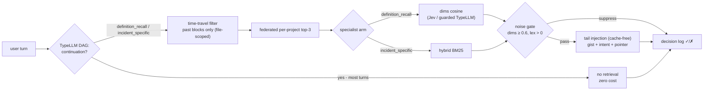

# pi-majordome

Topic-scoped, cross-session memory for pi agents — "infinite chat": keep
chatting across projects and weeks; the right past context loads when the
query calls for it, without wrecking the provider's prompt cache.

Status: **offline study complete (slices 1-5b) — next: the live pi extension.**
Read [docs/DESIGN.md](docs/DESIGN.md) and docs/EVAL-SLICE{1..5}.md +
docs/JUDGE-COMPARISON.md. Headline: TypeLLM DAG intent -> specialist arm
(Jev-vector vs lexical) reaches 3/7 recall@1 over the cross-session suite —
past every single arm and naive fusion (2/7); continuation detection fires
mid-suite; pair cells honestly refuse to join unrelated sessions (max
same_topic 0.36). Router spec v4 in docs/EVAL-SLICE5.md; next: confidence
arm-selection, same-product pair-cell fixture, then the live pi extension.

## Quick start

```sh
# offline tier (no key): boundaries + clustering + Jaccard/BM25 retrieval
python3 bench/eval.py \
  --session ~/.pi/agent/sessions/<project-dir>/<session>.jsonl

# add the TypeLLM tier (~11 calls; key from ~/.config/pi-codemap/typellm.key
# or TYPELLM_API_KEY)
python3 bench/eval.py --session <session.jsonl> --classify
```

The hand-labeled answer key for the reference session is `bench/key.json`
(6 blocks, 5 probes). Results land in `bench/results/report.json`.

## Layout

```
bench/eval.py             parser + boundary sweep + clustering + retrieval probes
bench/typellm_client.py   /v1/generate client (dims + intent + gist, one batched call)
bench/key.json            ground truth for the reference session
bench/results/            reports (v1-clean, v2, ema)
docs/EVAL-SLICE2.md       slice-two: hybrid retrieval, EMA, v2 dims
docs/EVAL-SLICE3.md       slice-three: RRF, rewrites, dim induction, router spec
bench/cross_eval.py       slice-four: two-session index, time-travel, federated pooling
bench/key_cross.json      cross-session ground truth (A gold + B ranges + 7 probes)
docs/EVAL-SLICE4.md       slice-four: cross-session recall, communities
bench/slice5.py           slice-five: pair cells, DAG intents, specialist arms
docs/EVAL-SLICE5.md       slice-five: specialist routing, router spec v4
docs/EVAL-SLICE5B.md      5b: pair-cell positive case, confidence arms rejected
bench/slice5b.py          5b: AUG index, chunked pair batteries
docs/DESIGN.md            design ledger (brainstorm trace, design laws)
docs/EVAL-SLICE1.md       slice-one methodology, results, diagnosis
```

## Install / run

```bash
pi install /path/to/pi-majordome        # or: pi --extension ./index.ts for dev
npx tsx ext/selfcheck.ts --parity       # offline assertions + bench replay parity
npx tsx tools/backfill.ts               # seed the index from bench artifacts (real vectors)
```

## Setup (majordome-only users; pi-codemap NOT required)

```bash
npx tsx ext/judges.ts setup     # paste TypeLLM key → ~/.config/pi-majordome/typellm.key
npx tsx ext/judges.ts verify    # one typed call proving key + transport
```

## Judge configs (all automatic, detected per session)

| you have | strings/gists | routing intent | dims numbers | behavior |
|---|---|---|---|---|
| both keys (recommended) | TypeLLM | TypeLLM DAG | Jev | full measured behavior |
| TypeLLM only | TypeLLM | TypeLLM DAG | guarded TypeLLM numbers | identical quality (A/B-proven config) |
| Jev only (no setup CLI needed) | **your chat model** (`reg.complete` — no extra key) | **Jev choice** | Jev | no query rewrite (raw terms); otherwise full router |
| neither | your chat model | — | — | indexing + gists only, recall off (status says so) |

- **TypeLLM key: enables the measured DAG path** (intent + search-term rewrite).
- **Jev: rides pi's classifier registry** (`TYPESAFE_API_KEY` or `/login`).
- Gist fallback uses **your own chat model** — gists cost a few hundred tokens
  at block close, zero extra API keys.
- `MAJORDOME_MIN_SCORE` (default 0.6) tunes the injection noise gate — see
  `/majordome stats` for the injected-vs-suppressed score gap.
- **Per session: nothing.** New and resumed sessions self-bootstrap
  (session_start reloads index + wiring; interrupted open tails are closed on
  the next turn_end). One-time history ingest, optional: `npx tsx tools/backfill.ts`.

## Composition & smart hints

- **pi-clm compatible** (installed alongside; `pi install npm:@lolipopshock/pi-clm`):
  pi-clm curates the window (learned compaction), majordome supplies recalled
  memory — different layers, verified co-loading.
- **Resume hint**: strong recall (score ≥ 0.7) on a definition_recall adds
  "looks like work already done — resume rather than redoing it".
- **Contradiction check**: on the same strong hits, one judge call asks whether
  the message REVERSES a decision in the recalled block — if yes, the agent is
  told to confirm before acting.

## Turn judge (per-turn annotation)

Every non-continuation turn is judged for ambiguity in the same DAG call.
The judge is deliberately **context-blind** (it sees your message + a sliver
of the last assistant turn — not the conversation), so its verdict is advice
to the agent, never an order: **soft** mode (default) appends
`Possible ambiguity (…) — if your tools or the conversation don't resolve it,
ask one clarifying question` and the agent decides; **strict** mode commands
clarify-first. Messages pointing at inspectable artifacts (URL, path, repo,
error output) are never ambiguous — that IS the specification. Debounced so
it never ping-pongs. Tune with `/majordome judge off|soft|strict` or
`MAJORDOME_JUDGE` env; `/majordome` dashboard shows the mode. When memory
fires, the recall line shows how the judge read the request
(`Read your request as: …`). Majordome never talks to the user — the agent
stays the interface.

## Known behaviors (v1, measured)

- **min-size guard**: a topic switch needs 4+ turns since the last boundary
  before a block can close — closes may lag a few turns; nothing is lost, the
  next boundary picks it up. Chatty one-liner sessions over-segment (EMA on
  tiny turns); coding sessions are the tuned distribution.
- **dims can fail open empty** (degenerate-vector guard) — the block still
  indexes with gist + lex retrieval; dims backfill on `reindex`.
- **chatty sessions trip the noise gate differently** than coding sessions —
  `/majordome stats` shows the injected-vs-suppressed gap; tune
  `MAJORDOME_MIN_SCORE` from it.
- **judge modes**: `/majordome judge off|soft|strict` — soft (default) informs
  the agent, strict orders clarify-first, off silences.
- **`[object Object]` sightings are NOT lost messages**: verified across all
  session history — user text is always persisted intact. The string appears
  only in what the MODEL receives (request-transform layer: majordome /
  pi-clm / vcc context transforms). If an agent claims your message was
  destroyed, `grep '"role":"user"' <session>.jsonl` — the truth is on disk.
- `reindex all` sweeps every session on disk — expect judge calls per block.

## Docs nudge (v1.x — never remind manually again)

At block close, majordome advances a per-doc **cursor** (README / CHANGELOG /
docs/) when the session touches them, and counts implementation blocks closed
since the last touch. At 3+, one tail line informs the agent — sourced from the
real gists, e.g. `[majordome docs] 4 implementation blocks since README/CHANGELOG
— recent: …` — so docs updates are grounded in what actually shipped, not
hallucinated from a summary. `/majordome export` produces the per-block ADRs;
the nudge is the trigger, the agent is the writer.

## Personality

Majordome never talks to the user — the agent does. Your `AGENTS.md` (per
project, or the orchestrator session's in v2) is where tone/verbosity/relay
preferences live. Majordome's own injected lines are fixed templates in code;
if they ever need user tuning, that becomes a small config file — not AGENTS.md
(prose there, machine templates here).

## Docs generation — `/majordome docs`

```
/majordome docs                          kinds + usage
/majordome docs readme [tag|all] [show]  digest since README cursor → agent updates README
/majordome docs changelog …              same for CHANGELOG
/majordome docs adr [tag|all]            per-block ADR files (same as /majordome export)
/majordome docs <custom> …               your template from ~/.pi/majordome/templates/<name>.md
```

A kind is an instruction template with a `{{digest}}` placeholder; the digest is
the doc-worthy blocks (implementation/documentation) **since that doc's cursor**
— the exact undocumented work, every line traceable to a block. Without `show`,
the composed instruction+digest is **sent to the agent** (`pi.sendUserMessage`),
which writes the doc; the cursor advances next time the session touches it.
Ships an example custom template (`html-explanation`) — see
`~/.pi/majordome/templates/`.

## Commands

```
/majordome                  dashboard: state, judges, projects, routing log (✓ injected ✗ suppressed — none)
/majordome list [tag]       table ToC: ID  TURNS  INTENT  GIST   (ids are short: code-parser:118)
/majordome show <id>        block record: gist, dims, first ask, transcript pointer
/majordome forget <id|tag|all>   purge from the index; session JSONLs untouched
/majordome export <id|tag|all> [dir]   markdown ADR per block (frontmatter + dims + provenance)
/majordome reindex [all]    rebuild from session files (backfills gists)
/majordome on | off         kill switch
```



## Status

- **v1 (this build)**: `turn_end` EMA indexer (tau 0.07 / min 4, the measured
  params), two-judge seam at block close, intent-specialist router (DAG →
  time-travel → federated top-3 → dims/lex arm), tail-only cache-safe
  injection, `/majordome` governance, decision log for calibration.
  Self-check: 23/23; live smoke: definition_recall → dims arm → 0.707 cosine,
  correct cross-session winner.
- **Live hardening** (bench/key_live.json, tools/livebench.ts — real probes
  mined from our own sessions): confident-gold recall 4/4 @1 (past + cross),
  continuation gate 3/3, noise gate dims<0.6 / lex==0 measured from the
  score distribution (true positive 0.707 vs noise ≤0.63). Fixed en route:
  continuation over-gating on mid-work phrasing (strict gate + recent-assistant
  context), abstention evidence for v1.x.
- **v1.x**: ADR export polish, gist backfill on reindex, mid-slot promotion.
- **v2**: orchestrator (firstmate-style) + memory consolidation; see OVERVIEW.
