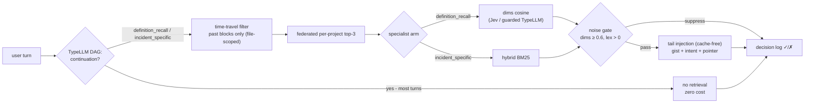

# pi-majordome

Topic-scoped, cross-session memory for pi agents — "infinite chat": keep
chatting across projects and weeks; the right past context loads when the
query calls for it, without wrecking the provider's prompt cache.

Status: **offline study complete (slices 1-5b) — next: the live pi extension.**
Read [docs/DESIGN.md](docs/DESIGN.md) and docs/EVAL-SLICE{1..5}.md +
docs/JUDGE-COMPARISON.md. Headline: TypeLLM DAG intent -> specialist arm
(Jev-vector vs lexical) reaches 3/7 recall@1 over the cross-session suite —
past every single arm and naive fusion (2/7); continuation detection fires
mid-suite; pair cells honestly refuse to join unrelated sessions (max
same_topic 0.36). Router spec v4 in docs/EVAL-SLICE5.md; next: confidence
arm-selection, same-product pair-cell fixture, then the live pi extension.

## Quick start

```sh
# offline tier (no key): boundaries + clustering + Jaccard/BM25 retrieval
python3 bench/eval.py \
  --session ~/.pi/agent/sessions/<project-dir>/<session>.jsonl

# add the TypeLLM tier (~11 calls; key from ~/.config/pi-codemap/typellm.key
# or TYPELLM_API_KEY)
python3 bench/eval.py --session <session.jsonl> --classify
```

The hand-labeled answer key for the reference session is `bench/key.json`
(6 blocks, 5 probes). Results land in `bench/results/report.json`.

## Layout

```
bench/eval.py             parser + boundary sweep + clustering + retrieval probes
bench/typellm_client.py   /v1/generate client (dims + intent + gist, one batched call)
bench/key.json            ground truth for the reference session
bench/results/            reports (v1-clean, v2, ema)
docs/EVAL-SLICE2.md       slice-two: hybrid retrieval, EMA, v2 dims
docs/EVAL-SLICE3.md       slice-three: RRF, rewrites, dim induction, router spec
bench/cross_eval.py       slice-four: two-session index, time-travel, federated pooling
bench/key_cross.json      cross-session ground truth (A gold + B ranges + 7 probes)
docs/EVAL-SLICE4.md       slice-four: cross-session recall, communities
bench/slice5.py           slice-five: pair cells, DAG intents, specialist arms
docs/EVAL-SLICE5.md       slice-five: specialist routing, router spec v4
docs/EVAL-SLICE5B.md      5b: pair-cell positive case, confidence arms rejected
bench/slice5b.py          5b: AUG index, chunked pair batteries
docs/DESIGN.md            design ledger (brainstorm trace, design laws)
docs/EVAL-SLICE1.md       slice-one methodology, results, diagnosis
```

## Install / run

```bash
pi install /path/to/pi-majordome        # or: pi --extension ./index.ts for dev
npx tsx ext/selfcheck.ts --parity       # offline assertions + bench replay parity
npx tsx tools/backfill.ts               # seed the index from bench artifacts (real vectors)
```

## Setup (majordome-only users; pi-codemap NOT required)

```bash
npx tsx ext/judges.ts setup     # paste TypeLLM key → ~/.config/pi-majordome/typellm.key
npx tsx ext/judges.ts verify    # one typed call proving key + transport
```

- **TypeLLM key: required for recall** (the intent DAG is the router's trigger).
  Without it majordome still indexes (turn_end) but gists stay empty and no
  injection ever fires; the status line says `recall off — run npx tsx ext/judges.ts setup`.
- **Jev: optional.** Rides pi's classifier registry (`TYPESAFE_API_KEY` or
  `/login`); guarded TypeLLM numbers take over automatically when absent.
- **Per session: nothing.** New and resumed sessions self-bootstrap
  (session_start reloads index + wiring; interrupted open tails are closed on
  the next turn_end). One-time history ingest, optional: `npx tsx tools/backfill.ts`.

## Commands

```
/majordome                  dashboard: state, judges, projects, routing log (✓ injected ✗ suppressed — none)
/majordome list [tag]       table ToC: ID  TURNS  INTENT  GIST   (ids are short: code-parser:118)
/majordome show <id>        block record: gist, dims, first ask, transcript pointer
/majordome forget <id|tag|all>   purge from the index; session JSONLs untouched
/majordome export <id|tag|all> [dir]   markdown ADR per block (frontmatter + dims + provenance)
/majordome reindex [all]    rebuild from session files (backfills gists)
/majordome on | off         kill switch
```



## Status

- **v1 (this build)**: `turn_end` EMA indexer (tau 0.07 / min 4, the measured
  params), two-judge seam at block close, intent-specialist router (DAG →
  time-travel → federated top-3 → dims/lex arm), tail-only cache-safe
  injection, `/majordome` governance, decision log for calibration.
  Self-check: 23/23; live smoke: definition_recall → dims arm → 0.707 cosine,
  correct cross-session winner.
- **Live hardening** (bench/key_live.json, tools/livebench.ts — real probes
  mined from our own sessions): confident-gold recall 4/4 @1 (past + cross),
  continuation gate 3/3, noise gate dims<0.6 / lex==0 measured from the
  score distribution (true positive 0.707 vs noise ≤0.63). Fixed en route:
  continuation over-gating on mid-work phrasing (strict gate + recent-assistant
  context), abstention evidence for v1.x.
- **v1.x**: ADR export polish, gist backfill on reindex, mid-slot promotion.
- **v2**: orchestrator (firstmate-style) + memory consolidation; see OVERVIEW.
