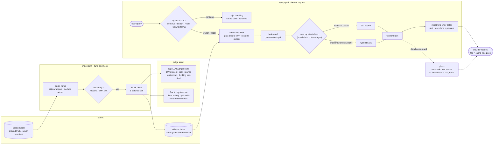

# pi-majordome — overview: benchmark summary + architecture

Condensed from `docs/EVAL-SLICE{1,2,3,4,5,5B}.md` + `docs/JUDGE-COMPARISON.md`.
Fixture: session A (code-parser, 101 turns, 6 gold blocks) + sessions SEP/AUG
(MorphEditor, 763/1208 turns) = 22 indexed blocks across 3 sessions.

## Index quality

| metric | value | slice |
|---|---|---|
| boundary F1, centroid Jaccard (±1 turn) | 0.462 | 1 |
| clustering accuracy, centroid | 0.755–0.757 | 1–2 |
| clustering accuracy, **EMA boundaries** | **0.903** | 2 |
| block gists + intents (manual audit) | accurate, readable ToC | 1–5 |

## Retrieval — the journey (5 gold probes, session A)

| method | recall@1 | slice |
|---|---|---|
| Jaccard, whole-block union | 0/5 | 1 |
| BM25, whole-block union | 0/5 | 1 |
| **hybrid BM25** (user turns + tail-3 + gist) | **2/5** | 2 |
| Jev-cosine, hand dims (v1/v2) | 1/5, 0/5 | 1–2 |
| Jev-cosine, induced dims | 0/5 | 3 |
| naive RRF (lex, jev) | 1/5 | 3 |
| **specialist (intent → arm)**, cross-suite | **3/7** | 5 |

Stuck-probe timeline (verbatim-94): 4 → 3 → 3 → **1** (time-travel +
federated, slice-4).

## Cross-session (7 probes, 3 sessions)

| capability | result | slice |
|---|---|---|
| federated per-session pooling | calendar 14/14 → 2/14 | 4 |
| time-travel candidates | routing probe → rank 1 (with federation) | 4 |
| continuation detection | T=52 correctly "current topic → no retrieval" | 4–5 |
| pair cells, unrelated sessions | honest negative (max 0.36) | 4–5 |
| **pair cells, same product** | **0.95 / 0.89 cross-session topic links** | 5b |
| community-as-unit | inert until cross-joins exist; Leiden resolution open | 5 |

## Judges

| finding | evidence |
|---|---|
| TypeLLM non-thinking numbers: rare non-deterministic flake (all-0.0) | 2 in ~150 calls; retried clean 4/4 |
| guard: retry nulls **and** degenerate all-0.0/all-1.0 vectors | 5/5 self-checks |
| thinking on dims: adds variance + 15× latency, no precision | A/B: none 0.95×4 vs 0.7–0.95 spread |
| Jev numbers: 94/94 deterministic-clean, catches inflation | judge comparison |
| seam: TypeLLM strings/DAG/multimodal · Jev calibrated numbers · 100%-TypeLLM = guarded config flip | DESIGN.md decisions |

## Architecture

Design laws: place invalidation (tail free, switches are natural resets) ·
session file never rewritten · one judge per data type (TypeLLM strings/DAG,
Jev numbers) · three index levels, messages unindexed · specialists not
averages · fail-open + visible + purgeable.

## v1 command surface — `/majordome`

One `pi.registerCommand()`; deterministic, zero model calls, never touches
the session JSONL.

| command | does |
|---|---|
| `/majordome` | dashboard: sessions, blocks, communities, current topic, last N routing decisions (query -> intent -> arm -> winner + score) |
| `/majordome list [session]` | ToC view: blocks as `gist - turns X-Y - intent` |
| `/majordome show <id>` | full block record: gist, dims, range, provenance, closing boundary |
| `/majordome forget <id\|session\|all>` | purge from the index (vector + pair cells gone); JSONL untouched |
| `/majordome export <id\|session> [path]` | ADR/markdown export (v1.x traceability) |
| `/majordome reindex` | rebuild side-car from session files |
| `/majordome on\|off` | kill switch: routing/injection off |

Not in v1: `merge` (needs real Leiden communities), any chat surface
(`/majordome` governs; recall is the router's job in conversation).

## Roadmap

### v1.x — traceability & export (independent of git)

Shipped (2026-10-03): governance seeds — judgment trail (trails.jsonl,
metadata-only, fail-open), push codex (~/.config/pi-majordome/codex.md), doc stamps
(generated_by/stale_after; verified human-only). Selfcheck: ext/selfcheck-governance.ts.

Source of truth stays the pi session JSONL (append-only, full fidelity:
every user/assistant message, tool call + result, compaction records,
extension custom entries). majordome adds the classified layer on top.

- **Block -> ADR export**: pure function over the index (frontmatter:
  session id, turn range, intent, dims; body: gist + decisions).
  Exported `.md` files can round-trip back in as ingest.
- **Nested-call note**: majordome's index is unaffected by pi's bounded
  `nestedCalls` records — it indexes user + assistant text, which always
  appear in full. Verbatim replay of deeply nested tool *results* is a
  detail-recall limitation (vcc layer), not an index gap.

### v2 — orchestrator + memory consolidation

**Build status (branch `v2`, worktree `../pi-majordome-v2` — 2026-10-03):**
- ✅ **0** resume bench: 8 probes, pre-registered criteria; immutable baseline `resume-baseline.json`
  (recall-only hit@3 **1/6**, continuation gate 2/2); runs → `resume-last.json`
- ✅ **1** one-pager: `/majordome one-pager [tag|show]` — composed over GIST atoms, provenance-cited,
  stamped; **A/B: 4/6 vs 1/6** (res-decision-soft, res-leaveoff-onepager, res-invalidated-markmap,
  res-decision-clarify now hit)
- ✅ **2** ingest adapter: `/majordome ingest-docs`, sources in `~/.config/pi-majordome/docs-sources.json`
  (smoke: 9 files → 62 blocks, idempotent)
- ✅ **3** map: `/majordome map` → `.majordome/map.mmd` (Mermaid mindmap, ✗ invalidations) +
  `map.json`; pane: `termaid .majordome/map.mmd`
- ✅ **4** Self-Index: `ext/selfindex.ts` — MISSES → keyPhrases judge → gated (102) → keys folded
  (36/9 blocks); recall unchanged (missing golds are index *coverage* at 38 blocks, not keying)
- fixed en route: latent master bug — `/majordome docs` ReferenceError (lost ext/docs.ts import)
- ✅ **2.5 `/majordome init`** — cold-start over past sessions: same-slug indexed with judges
  (resumable cursor, dry-run cost preview, mtime provenance), other slugs **parked as lineage**
  (map-only, `--lineage <slug>` opt-in). Run on code-parser: 38 → **70 blocks, 100% gisted**.
  One-pager A/B after init: 4/6 (timestamp bug 3/6 caught + fixed — ingest must keep original time).
- ❌ REJECTED: lexical floor in the dims arm (max(cos, 0.5·bm25norm)) — 1/6 → 1/6; same-topic
  corpora collide on polysemous terms, idf can't discriminate within a project. Root cause of
  remaining MISSes = gist compression + dims quality, not lexing. Documented in-code.
- next: orchestrator scope review (Durable A/B) + AGENTS.md pointer block (artifacts now exist)
- ✅ **durable study** (`docs/durable-study.md`): Path A for v2.0 + durable sidecar; full Path B
  deferred (experimental API, Harness rebuild). Verified by working crash/resume prototype.
- ✅ **v2.0 orchestrator pieces**:
  - shared-brain parity: 4 concurrent writers × 50 single-line appends → 200/200, 0 dupes
    (`tools/parity.ts`) — dispatch storage assumption proven
  - **mjdx-sidecar** (`durable-sidecar/`): map-maintenance as a durable task — refreshes
    one-pager/map.json for registered projects (sidecars.json), checkpoint per project, fs-mtime
    skip for unchanged inputs; crash/resume inherited from the verified proto pattern
  - AGENTS.md pointer block live in code-parser (committed c772961)
- ✅ **dispatch built, surface-agnostic**: tools/dispatch.ts — headless (pi -p, session saved +
  indexed) and pane (herdr agent) modes, cold-start guard (init when slug memory empty), status
  (per-worker block counts). Verified live: one dispatcher spawned workers in code-parser +
  MorphEditor; both saved sessions into the shared brain. Web frontend later = Durable
  viewState/subscribe on the same lifecycle.
- **v2.4 spec (lifecycle states)** — consolidation is lifecycle maintenance over the
  classification we already have: block.status = valid (default) | superseded | failed |
  speculative. Pair-judges assign states (contradicts → superseded; outcome-verdict →
  tried-and-failed); recall filters default-valid (failed/superseded surface on explicit
  "what did we try" queries); doctor reports the distribution. Runs as sidecar job or at
  recall time. Gate: map maturity from the dogfood stretch.
- open for review: worker dispatch protocol UX (Herdr panes vs headless), sidecar adoption as
  default-on, consolidation (v2.4) still gated on the map

**Architecture fork (decided at study phase):** Pi 1.0 shipped Pi Durable
(earendil.com/posts/pi-durable) — a durable harness: tasks with ownership
trees (subagent = conversation owned by a tool call), pluggable SQLite/JSONL
storage, compaction-as-task with hooks that can write summaries themselves
(= pi-vcc logic transfer path), request-rewrite hooks (= majordome
router/injection/one-pager), multiplayer steering. Fork: **Path A** =
firstmate-style worker pi processes (stable, Herdr-visible) vs **Path B** =
Durable-native orchestrator (cleaner, crash-safe, experimental API). Study
phase starts with the Durable README + coding-agent example + a
vacation-planner-sized throwaway prototype BEFORE choosing. Herdr remains the
surface layer either way (panes can watch Durable threads).

- **Orchestrator**: one chat dispatching per-project worker pi sessions,
  referencing `~/Documents/vibe/firstmate` (visible panes, worktree
  isolation, zero-token supervision, restart-proof state); majordome is the
  shared brain — every spawned session indexed the same way.
- **Memory consolidation & external documents** (Instinct/supermemory
  inspired: git-tracked markdown memory, daily consolidation, one-pager):
  md+frontmatter ingest adapter (frontmatter -> metadata/dims, body ->
  block text) so retrieval spans chats AND curated docs (ADRs, specs,
  operator-memory-style notes); per-project rolling "one-pager" from top
  community gists; consolidation/forgetting policy; multimodal extraction
  (screenshots in sessions — TypeLLM-class, deferred from v1).
- **Context Language Models integration study** (our own paper,
  arXiv 2609.37725 — `~/Documents/vibe/context-language-models`):
  CLM = model curates its own context as a file; complementary layer to
  majordome (we supply WHAT to recall, CLM manages WHAT stays in-window).
  Study items: (a) project one-pager as CLM-style model-maintained file vs
  our composed-gists page (A/B, their data says maintained wins);
  (b) ICL-steering loop applied to our injection preamble + DAG prompts
  (decision log = feedback signal); (c) Suffix Cache Reuse (SCR) serving
  makes mid-context edits cheap -> revisit deferred mid-slot promotion
  when SCR-style serving spreads; (d) eval: Harbor tasks (BCP, EdgeBench,
  24h agent-swarm) + ContextBench (coming soon) for end-to-end
  majordome vs pi-clm (`npm:@lolipopshock/pi-clm`) vs both-together —
  the swarm task is the v2 orchestrator scenario.
  - **One-pager decision**: composed first, vcc-style (~/Documents/vibe/pi-vcc
    proves algorithmic extraction: deterministic, zero-cost, 5 semantic
    sections) — but over GIST atoms (already semantic from block close), so
    vcc's weakness (no meaning extraction) is pre-solved. TypeLLM/agent
    "judge and expand" only if the bench shows gaps. The one-pager doubles
    as the SCOPE PRIOR source: query-vs-page similarity weights federated
    pools (fixes cross-project vocabulary collisions; works from block zero,
    unlike log-learned priors which need hundreds of decisions).
  - **Self-Index** (~/Documents/vibe/Self-Index): label-free index evolution —
    documents gain generated keys, refined by diagnosing wrong retrievals
    with simulated queries (faithfulness/specificity/separation gates).
    Direct transfer: our blocks' keys (tokensHybrid + gist + dims) gain
    generated search-phrases revised against livebench MISSES (the diagnosed
    set already exists: past-judge-seam, herdr-dep, export-bug). Also
    LongMemEval-V2 benchmark = our category.
  - **snifftest** (~/Documents/vibe/snifftest): output-register linting —
    deliberately NOT majordome (different layer); candidate pi skill.
    Their 0.4-0.6 "no judgment" dead band validates our abstention gate.
- **Reasoning map** (2026-10-03 study; okf-agent-memory/OpenKB/IBIS): the session gets a
  derived projection — IBIS-style tree (branches = questions/assumptions, leaves = results,
  promotions, invalidations-with-reason + turn pointers). trail = append-only source; map =
  rebuildable projection (never the truth). v1.7 candidate: lazy `/majordome map` — batch-compile
  log → `map.mmd` (Mermaid **mindmap**, short labels; same diagram language as dc_diagram) +
  `map.json` (turn pointers, the machine side), git-committed. Display: zero-dep **termaid** in a
  Herdr pane (`termaid .majordome/map.mmd` — pipe-friendly, terminal-width-aware; markmap dropped:
  unwanted JS pipeline; static render is fine for a ToC, rich HTML later via any Mermaid viewer
  if ever needed); ADRs = promoted leaves; one-pager = promoted-only linearization of the same tree.
  Use: pre-query structural filter (codemap pattern) — map hit → inject branch bundle (branch +
  leaves + why alternatives died); miss/low-confidence → fail open to vcc_recall (law: fail-open).
  Killer feature = invalidation memory: stops post-compaction re-litigation. Live per-turn map
  maintenance + **reconcile-on-ingest** (new evidence updates affected branches/pages — OpenKB's
  keep-in-sync wiki is the reference) = v2 orchestrator durable jobs (judge battery rides the
  existing routing DAG).
- **Governance seeds** (okf-agent-memory DMAA study): (1) push codex — ~100–150-token AAG-style
  invariants file (search-before-write as MUST, never-rewrite-sessions, soft-judge default);
  (2) judgment trail — append-only verdicts {ts, judge, rule/dims-version, verdict, confidence}
  (code-parser trails.jsonl pattern) = auditability + permanent calibration feed; (3) doc stamps —
  generated/verified (human-only verified) + stale_after on `/majordome docs` output. Policy
  pack TREE (corporate→business-unit→team, tighten-only inheritance, gates resolving version
  chains, verdicts citing the resolved chain) = design-only until an enterprise deployment
  lands. CrewAI ships only the platform layer (RBAC/SSO/audit + GuardrailProvider slot); the
  content-governance seat is open — that gap is the differentiator.
- **Dataset factory** (free-lunch note): raw-first trace is replayable → future training/distill
  data is a batch job, never a design decision. Real costs land post-v2.4: consolidation = the
  cleaning (promoted branches = positives, invalidated = negatives), judged axes = auto-labels,
  PII scrub = the governance layer. Free because raw-first; easy after consolidation exists.
  References for the study phase (do not read until v2):
  - `~/Documents/vibe/supermemory`
  - `~/Documents/vibe/memorybench`
  - `~/Documents/vibe/OpenKB` (compile-don't-rederive wiki; reconcile-on-ingest; Skill Factory;
    PageIndex vectorless tree retrieval — same ancestor Jevbox cites)
  - `~/Documents/vibe/okf-agent-memory` (DMAA push/pull, AAG codex, trust tiers, --for-path
    triggers; Google OKF v0.2)
  - `/home/aurel/Documents/current/CognitiveOS/v3` (ingest_formats,
    retrieval_bench prior art)
  - `~/Documents/vibe/context-language-models` (paper + SCR + harness)
  - `~/Documents/vibe/Self-Index` (label-free key evolution)
  - `~/Documents/vibe/pi-vcc` (composition method reference)
  - Pi Durable FIRST: earendil.com/posts/pi-durable + packages/durable README
    + packages/coding-agent/src/experimental/durable + /vacation examples
    (https://github.com/earendil-works/pi) — decide Path A vs B
